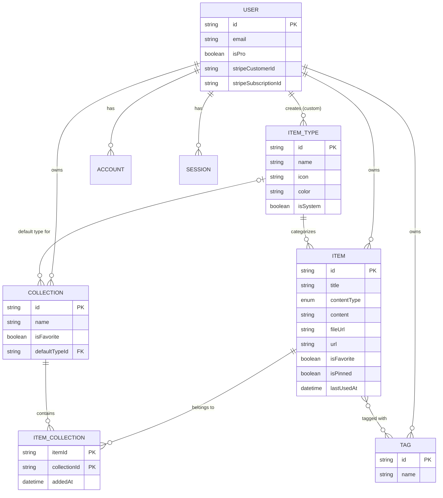
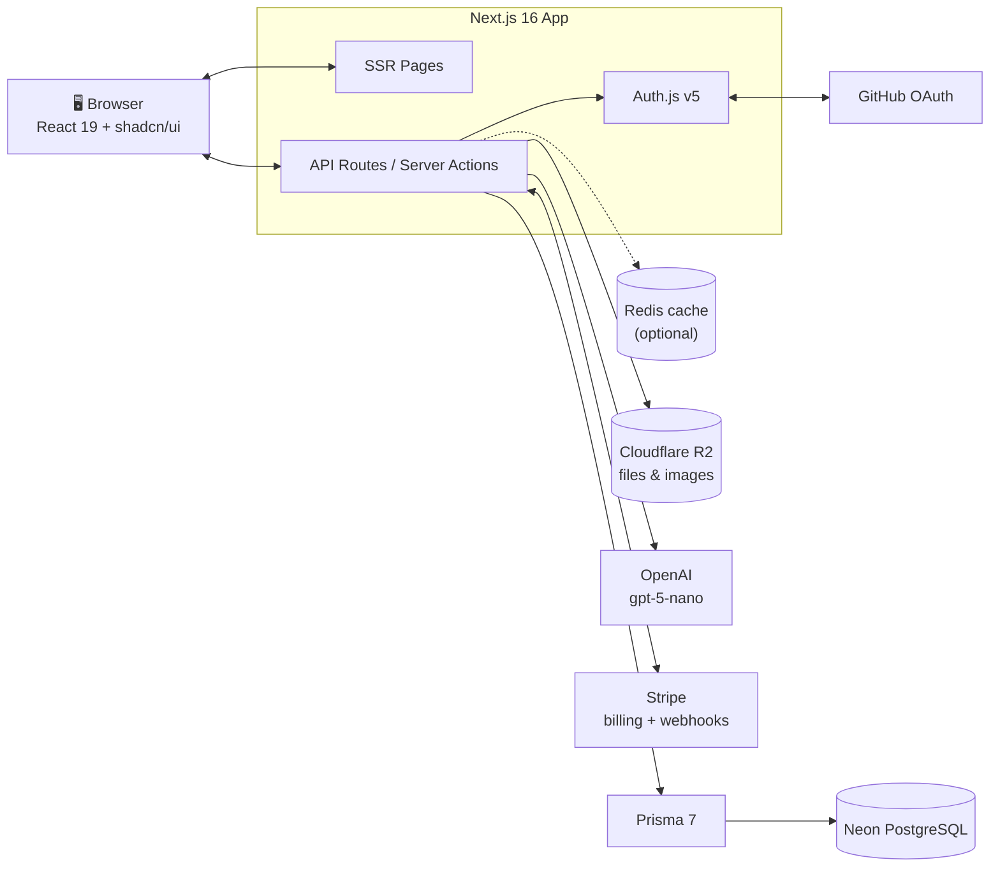
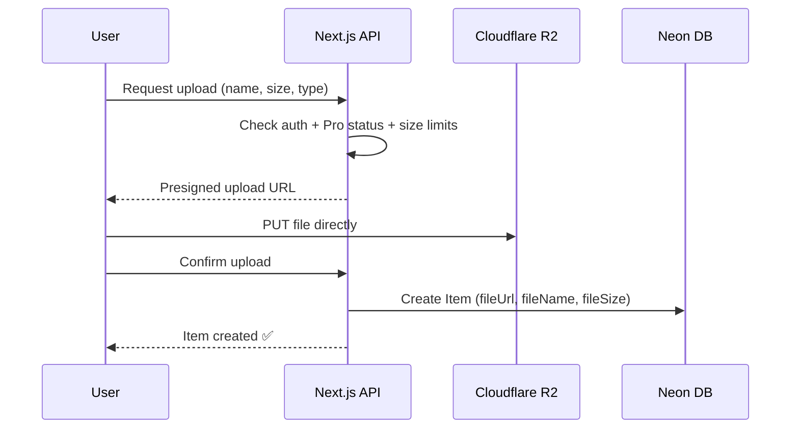

# 🗃️ DevStash — Project Overview

> **One fast, searchable, AI-enhanced hub for all your developer knowledge and resources.**

DevStash is a freemium SaaS where developers store and find their snippets, AI prompts, notes, terminal commands, links, files, and images in one place, organized into collections and searchable.

---

## Table of Contents

1. [Problem](#-problem)
2. [Target Users](#-target-users)
3. [Features](#-features)
4. [Data Model](#-data-model)
5. [Tech Stack](#-tech-stack)
6. [Architecture](#-architecture)
7. [Monetization](#-monetization)
8. [UI/UX](#-uiux)
9. [Routes](#-routes)
10. [Development Rules](#-development-rules)
11. [Open Questions](#-open-questions)
12. [Resources](#-resources)

---

## 🧩 Problem

Developers keep their essentials scattered across many tools:

| Resource            | Where it usually lives         |
| ------------------- | ------------------------------ |
| Code snippets       | VS Code, Notion                |
| AI prompts          | Old chat threads               |
| Context files       | Buried inside projects         |
| Useful links        | Browser bookmarks              |
| Docs                | Random folders                 |
| Commands            | `.txt` files                   |
| Project templates   | GitHub Gists                   |
| Terminal commands   | Bash history                   |

The result is constant context switching, lost knowledge, and inconsistent workflows. **DevStash puts all of it in one place.**

---

## 👥 Target Users

| Persona                         | Primary need                                                  |
| ------------------------------- | ------------------------------------------------------------- |
| 🧑‍💻 **Everyday Developer**        | Quickly grab snippets, prompts, commands, and links           |
| 🤖 **AI-first Developer**         | Save prompts, context files, workflows, and system messages   |
| 🎓 **Content Creator / Educator** | Store code blocks, explanations, and course notes             |
| 🏗️ **Full-stack Builder**         | Collect patterns, boilerplates, and API examples              |

---

## ✨ Features

### A. Items & Item Types

Every item has a **type**. DevStash ships with the following **system types**, which users cannot edit or delete. Custom user-defined types will come later (Pro).

| Type    | Content kind | Icon (Lucide) | Color     | Plan |
| ------- | ------------ | ------------- | --------- | ---- |
| Snippet | Text         | `Code`        | `#3b82f6` | Free |
| Prompt  | Text         | `Sparkles`    | `#8b5cf6` | Free |
| Note    | Text         | `StickyNote`  | `#fde047` | Free |
| Command | Text         | `Terminal`    | `#f97316` | Free |
| Link    | URL          | `Link`        | `#10b981` | Free |
| File    | File         | `File`        | `#6b7280` | Pro  |
| Image   | File         | `Image`       | `#ec4899` | Pro  |

- **Text** types (snippet, prompt, note, command) use a Markdown editor, with syntax highlighting for code.
- **URL** types (link) store a URL plus an optional description.
- **File** types (file, image) upload to Cloudflare R2.
- Type list pages use pluralized slugs, e.g. `/items/snippets`, `/items/prompts`.
- Items open and are created in a **drawer** so they're quick to reach without leaving the current page.

### B. Collections

- Users create collections that can hold items of **any type**.
- An item can belong to **multiple collections** (many-to-many). For example, a React snippet can live in both *React Patterns* and *Interview Prep*.
- An item's detail view shows every collection it belongs to, and items can be added to or removed from several collections at once.

Example collections:

| Collection       | Typical contents  |
| ---------------- | ----------------- |
| React Patterns   | Snippets, notes   |
| Context Files    | Files             |
| Python Snippets  | Snippets          |

### C. Search

Search runs across **titles**, **content**, **tags**, and **types**. The free tier gets basic search; more advanced search can become a Pro upgrade later.

### D. Authentication

- Email and password (credentials)
- GitHub OAuth

### E. Other Features

- ⭐ Favorite collections and items
- 📌 Pin items to the top
- 🕒 Recently used items
- 📥 Import code from a file
- 📝 Markdown editor for text types
- 📤 File upload for file and image types
- 💾 Data export (JSON / ZIP), Pro only
- 🌙 Dark mode by default, with light mode as an option
- 🗂️ Add or remove items from multiple collections

### F. AI Features (Pro only)

| Feature                    | Description                                         |
| -------------------------- | --------------------------------------------------- |
| 🏷️ Auto-tag suggestions     | Suggests tags based on an item's content            |
| 📄 Summaries                | Produces short summaries of long notes and files    |
| 💡 Explain This Code        | Gives a plain-English explanation of a snippet      |
| ⚡ Prompt Optimizer         | Rewrites prompts to make them clearer and stronger  |

---

## 🗄️ Data Model

> ⚠️ This is a working draft and will change as the project develops.

### Entity Relationship Diagram



### Prisma Schema (draft)

> Prisma 7 notes: the generator is `prisma-client` with a required `output` path, the connection URL now lives in `prisma.config.ts` rather than in `schema.prisma`, and the Neon connection goes through a driver adapter (`@prisma/adapter-neon` or `@prisma/adapter-pg`). Check these details against the [current Prisma docs](https://www.prisma.io/docs) before you set things up.

```prisma
// prisma/schema.prisma

generator client {
  provider = "prisma-client"
  output   = "../src/generated/prisma"
}

datasource db {
  provider = "postgresql"
}

// ─────────────────────────────────────────────
// Enums
// ─────────────────────────────────────────────

enum ContentType {
  TEXT
  URL
  FILE
}

// ─────────────────────────────────────────────
// Auth (Auth.js / NextAuth v5 Prisma adapter)
// ─────────────────────────────────────────────

model User {
  id                   String    @id @default(cuid())
  name                 String?
  email                String    @unique
  emailVerified        DateTime?
  image                String?
  password             String?   // hashed; null for OAuth-only users

  // Billing
  isPro                Boolean   @default(false)
  stripeCustomerId     String?   @unique
  stripeSubscriptionId String?   @unique

  accounts    Account[]
  sessions    Session[]
  items       Item[]
  itemTypes   ItemType[]
  collections Collection[]
  tags        Tag[]

  createdAt DateTime @default(now())
  updatedAt DateTime @updatedAt
}

model Account {
  id                String  @id @default(cuid())
  userId            String
  type              String
  provider          String
  providerAccountId String
  refresh_token     String? @db.Text
  access_token      String? @db.Text
  expires_at        Int?
  token_type        String?
  scope             String?
  id_token          String? @db.Text
  session_state     String?

  user User @relation(fields: [userId], references: [id], onDelete: Cascade)

  @@unique([provider, providerAccountId])
  @@index([userId])
}

model Session {
  id           String   @id @default(cuid())
  sessionToken String   @unique
  userId       String
  expires      DateTime

  user User @relation(fields: [userId], references: [id], onDelete: Cascade)

  @@index([userId])
}

model VerificationToken {
  identifier String
  token      String   @unique
  expires    DateTime

  @@unique([identifier, token])
}

// ─────────────────────────────────────────────
// Core domain
// ─────────────────────────────────────────────

model Item {
  id          String      @id @default(cuid())
  title       String
  description String?
  contentType ContentType @default(TEXT)

  // Text types
  content  String? @db.Text
  language String? // optional, for code highlighting

  // Link type
  url String?

  // File types (stored in Cloudflare R2)
  fileUrl  String?
  fileName String?
  fileSize Int?    // bytes

  isFavorite Boolean   @default(false)
  isPinned   Boolean   @default(false)
  lastUsedAt DateTime? // powers "Recently used"

  userId String
  user   User   @relation(fields: [userId], references: [id], onDelete: Cascade)

  itemTypeId String
  itemType   ItemType @relation(fields: [itemTypeId], references: [id], onDelete: Restrict)

  tags        Tag[]            // implicit many-to-many
  collections ItemCollection[]

  createdAt DateTime @default(now())
  updatedAt DateTime @updatedAt

  @@index([userId])
  @@index([userId, itemTypeId])
  @@index([userId, isPinned])
  @@index([userId, lastUsedAt])
}

model ItemType {
  id       String  @id @default(cuid())
  name     String  // "snippet", "prompt", ...
  slug     String  // "snippets", "prompts" (used in URLs)
  icon     String  // Lucide icon name
  color    String  // hex
  isSystem Boolean @default(false)

  // null for system types
  userId String?
  user   User?   @relation(fields: [userId], references: [id], onDelete: Cascade)

  items              Item[]
  defaultCollections Collection[]

  @@unique([userId, name])
  @@index([userId])
}

model Collection {
  id          String  @id @default(cuid())
  name        String
  description String?
  isFavorite  Boolean @default(false)

  // type used for display when the collection has no items yet
  defaultTypeId String?
  defaultType   ItemType? @relation(fields: [defaultTypeId], references: [id], onDelete: SetNull)

  userId String
  user   User   @relation(fields: [userId], references: [id], onDelete: Cascade)

  items ItemCollection[]

  createdAt DateTime @default(now())
  updatedAt DateTime @updatedAt

  @@index([userId])
}

model ItemCollection {
  itemId       String
  collectionId String
  addedAt      DateTime @default(now())

  item       Item       @relation(fields: [itemId], references: [id], onDelete: Cascade)
  collection Collection @relation(fields: [collectionId], references: [id], onDelete: Cascade)

  @@id([itemId, collectionId])
  @@index([collectionId])
}

model Tag {
  id   String @id @default(cuid())
  name String

  userId String
  user   User   @relation(fields: [userId], references: [id], onDelete: Cascade)

  items Item[]

  @@unique([userId, name])
}
```

#### Schema notes and changes from the original notes

- **`contentType`** is now an enum with three values: `TEXT`, `URL`, and `FILE`. The original notes described three kinds of type (text, url, and file) but listed only `text | file` for this field.
- **Tags are scoped per user.** Without that, tags would be shared across all accounts.
- **`slug` was added to `ItemType`** so routes like `/items/snippets` map cleanly to a type.
- **`lastUsedAt` was added to `Item`** to power the "Recently used" feature.
- **`password` was added to `User`** to support email and password login.
- **System types have a `null` `userId`.** PostgreSQL treats `NULL` values as distinct in unique constraints, so `@@unique([userId, name])` does **not** prevent duplicate system types. Make the seed script idempotent, for example by looking a type up by name before creating it.
- **Pinned items sort first:** `orderBy: [{ isPinned: 'desc' }, { updatedAt: 'desc' }]`.

### Seed: System Item Types

```ts
// prisma/seed.ts (excerpt)
export const SYSTEM_ITEM_TYPES = [
  { name: "snippet", slug: "snippets", icon: "Code",       color: "#3b82f6" },
  { name: "prompt",  slug: "prompts",  icon: "Sparkles",   color: "#8b5cf6" },
  { name: "command", slug: "commands", icon: "Terminal",   color: "#f97316" },
  { name: "note",    slug: "notes",    icon: "StickyNote", color: "#fde047" },
  { name: "file",    slug: "files",    icon: "File",       color: "#6b7280" },
  { name: "image",   slug: "images",   icon: "Image",      color: "#ec4899" },
  { name: "link",    slug: "links",    icon: "Link",       color: "#10b981" },
] as const;
```

---

## 🛠️ Tech Stack

| Layer            | Technology                                                        |
| ---------------- | ----------------------------------------------------------------- |
| Framework        | [Next.js 16](https://nextjs.org/docs) (App Router) + React 19     |
| Language         | TypeScript                                                        |
| Rendering        | SSR pages with dynamic client components                          |
| Backend          | Next.js API routes / Server Actions                               |
| Database         | [Neon](https://neon.tech/docs) (serverless PostgreSQL)            |
| ORM              | [Prisma 7](https://www.prisma.io/docs)                            |
| Caching          | Redis *(optional, decide later)*                                  |
| File storage     | [Cloudflare R2](https://developers.cloudflare.com/r2/) (S3-compatible) |
| Auth             | [Auth.js / NextAuth v5](https://authjs.dev) with credentials and GitHub |
| AI               | [OpenAI](https://platform.openai.com/docs) `gpt-5-nano`           |
| Payments         | [Stripe](https://docs.stripe.com) (subscriptions)                 |
| Styling          | [Tailwind CSS v4](https://tailwindcss.com/docs)                   |
| UI components    | [shadcn/ui](https://ui.shadcn.com)                                |
| Icons            | [Lucide](https://lucide.dev)                                      |

The project is a single codebase in one repo to keep overhead low.

---

## 🏛️ Architecture



### File Upload Flow



---

## 💳 Monetization

DevStash uses a freemium model.

| Feature                    | Free                      | Pro                        |
| -------------------------- | :-----------------------: | :------------------------: |
| **Price**                  | $0                        | **$8/mo** or **$72/yr**    |
| Items                      | 50 total                  | Unlimited                  |
| Collections                | 3                         | Unlimited                  |
| System types               | All except file and image | All                        |
| File and image uploads     | ❌                        | ✅                         |
| Custom types               | ❌                        | ✅ *(coming later)*        |
| Search                     | Basic                     | Basic                      |
| AI auto-tagging            | ❌                        | ✅                         |
| AI summaries               | ❌                        | ✅                         |
| AI code explanation        | ❌                        | ✅                         |
| AI prompt optimizer        | ❌                        | ✅                         |
| Export (JSON / ZIP)        | ❌                        | ✅                         |
| Priority support           | ❌                        | ✅                         |

The yearly plan works out to $6/mo, a 25% discount.

> 🚧 **During development:** build the Pro gating foundation (`isPro`, Stripe fields, limit checks), but let **every user access all features**. A single flag keeps this simple:
>
> ```ts
> // src/lib/plan.ts
> const ENFORCE_PLAN_LIMITS = process.env.ENFORCE_PLAN_LIMITS === "true";
>
> export function canUsePro(user: { isPro: boolean }) {
>   return !ENFORCE_PLAN_LIMITS || user.isPro;
> }
> ```

---

## 🎨 UI/UX

### Design Principles

- Modern, minimal, and developer-focused, drawing on [Notion](https://notion.so), [Linear](https://linear.app), and [Raycast](https://raycast.com)
- **Dark mode by default**, with light mode as an option
- Clean typography and generous whitespace
- Subtle borders and shadows
- Syntax highlighting for code blocks

### Screenshots

Refer to the screenshots below as a base for the dashboard UI. It does not have to be exact. Use it as a reference:

- @context/screenshots/dashboard-ui-main.png
- @context/screenshots/dashboard-ui-drawer.png

### Layout

```
┌──────────────────────────────────────────────────────────────┐
│  🔍 Search…                                      [+ New] 👤  │
├───────────────┬──────────────────────────────────────────────┤
│ SIDEBAR  «    │  MAIN                                        │
│               │                                              │
│ Types         │  Collections                                 │
│  </> Snippets │  ┌──────────┐ ┌──────────┐ ┌──────────┐      │
│  ✨ Prompts   │  │ React    │ │ Context  │ │ Python   │      │
│  >_ Commands  │  │ Patterns │ │ Files    │ │ Snippets │      │
│  🗒 Notes     │  └──────────┘ └──────────┘ └──────────┘      │
│  📄 Files     │   ↑ background color = dominant item type     │
│  🖼 Images    │                                              │
│  🔗 Links     │  Items                                       │
│               │  ┃ useDebounce hook        (blue border)     │
│ Collections   │  ┃ Refactor prompt         (purple border)   │
│  ⭐ Favorites │  ┃ docker compose up -d    (orange border)   │
│  • Recent…    │                                              │
└───────────────┴──────────────────────────────────────────────┘
                              Item click → opens side drawer ▶
```

- **Sidebar (collapsible):** item types with links to their list pages, plus the latest and favorite collections.
- **Main area:** a grid of collection cards, each with a **background color** taken from the type it holds most. Item cards appear below with a **border color** matching their type.
- **Item drawer:** view, edit, and create items without leaving the page.

### Responsive

- Desktop-first, but usable on mobile
- On mobile, the sidebar becomes a slide-out drawer (shadcn `Sheet`)

### Micro-interactions

- Smooth transitions
- Hover states on cards
- Toast notifications for actions (shadcn `Sonner`)
- Loading skeletons (shadcn `Skeleton`)

---

## 🧭 Routes

| Route                       | Description                                       |
| --------------------------- | ------------------------------------------------- |
| `/`                         | Marketing / landing page                          |
| `/sign-in`, `/sign-up`      | Authentication                                    |
| `/dashboard`                | Collections grid and recent or pinned items       |
| `/items/[type]`             | Items by type, e.g. `/items/snippets`             |
| `/collections`              | All collections                                   |
| `/collections/[id]`         | A single collection's items                       |
| `/favorites`                | Favorite items and collections                    |
| `/search?q=`                | Search results                                    |
| `/settings`                 | Profile, theme, and export                        |
| `/settings/billing`         | Stripe subscription management                    |
| `/api/auth/[...nextauth]`   | Auth.js handlers                                  |
| `/api/upload`               | R2 presigned upload URLs                          |
| `/api/ai/*`                 | Tagging, summary, explain, and optimize endpoints |
| `/api/webhooks/stripe`      | Stripe webhook receiver                           |

---

## 📏 Development Rules

> 🛑 **Never use `prisma db push` or change the database structure directly.**
> Every schema change goes through migrations. Create and apply them in development, then deploy them to production.

```bash
# Development: create and apply a migration
npx prisma migrate dev --name <descriptive_name>

# Production: apply pending migrations
npx prisma migrate deploy
```

Other rules:

- Use TypeScript everywhere, with strict mode on.
- Check auth, ownership, and plan limits **on the server** for every mutation.
- Keep secrets such as `DATABASE_URL`, `AUTH_SECRET`, `AUTH_GITHUB_ID`, `AUTH_GITHUB_SECRET`, `R2_*`, `OPENAI_API_KEY`, and `STRIPE_*` in `.env`, and never commit them.

---

## ❓ Open Questions

- [ ] Is Redis needed at launch, or can it wait until performance requires it?
- [ ] Search implementation: Prisma `contains`, Postgres full-text search (`tsvector`), or an external service?
- [ ] File size limits per upload and total storage per Pro user?
- [ ] Should export formats beyond JSON / ZIP (e.g., Markdown) be supported?
- [ ] What happens to a downgraded user's data when it exceeds free limits (read-only vs. blocked creation)?
- [ ] Should AI features have per-user rate limits or usage caps to control cost?

---

## 🔗 Resources

- [Next.js Docs](https://nextjs.org/docs)
- [React Docs](https://react.dev)
- [Prisma Docs](https://www.prisma.io/docs)
- [Prisma + Neon Guide](https://neon.tech/docs/guides/prisma)
- [Auth.js Docs](https://authjs.dev)
- [Auth.js Prisma Adapter](https://authjs.dev/getting-started/adapters/prisma)
- [Cloudflare R2 Docs](https://developers.cloudflare.com/r2/)
- [OpenAI API Docs](https://platform.openai.com/docs)
- [Stripe Subscriptions](https://docs.stripe.com/billing/subscriptions/overview)
- [Tailwind CSS v4](https://tailwindcss.com/docs)
- [shadcn/ui](https://ui.shadcn.com)
- [Lucide Icons](https://lucide.dev/icons)
